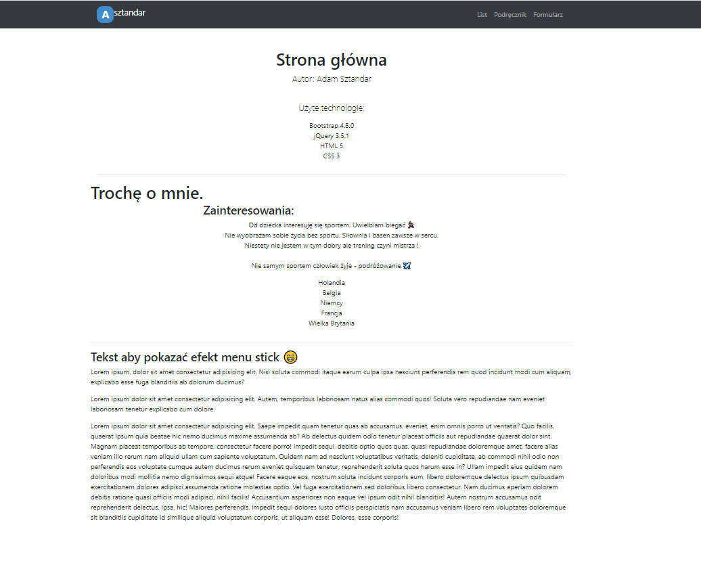
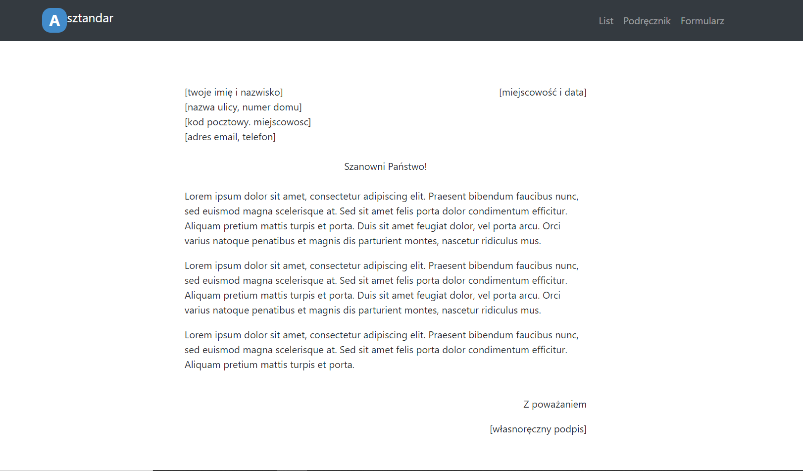
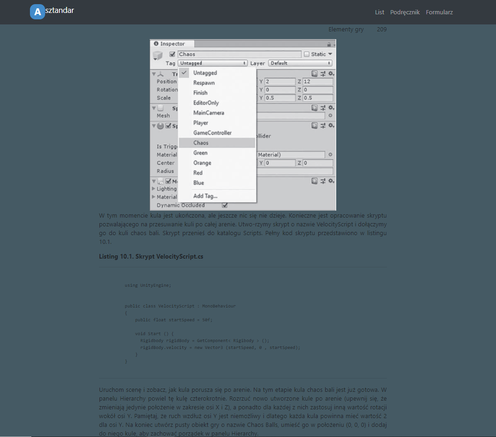
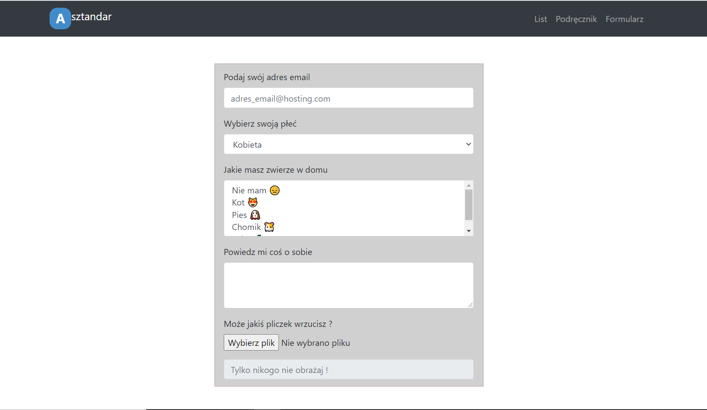

# Lab1 Prosta strina www.

### Wykorzystane technologie.
* HTML5
* Bootstrap
* CSS
* JavaScript

### Przedstawienie rezultatów.

__Strona główna__ - strona zawiera informacje o użytych technologiach oraz krótką informacje o mnie.

__List__ - strona zawierająca sformatowany list.

__Podręcznik__ - strona zawiera losowo wybraną stronę z podręcznika.

__Formularz__ - strona zawiera przykładowy formularz.
