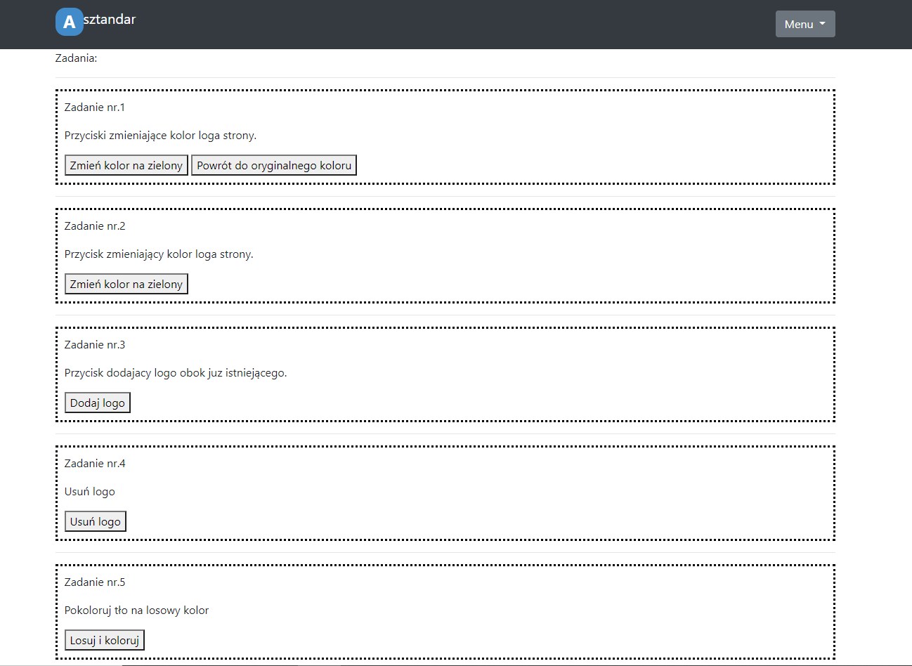
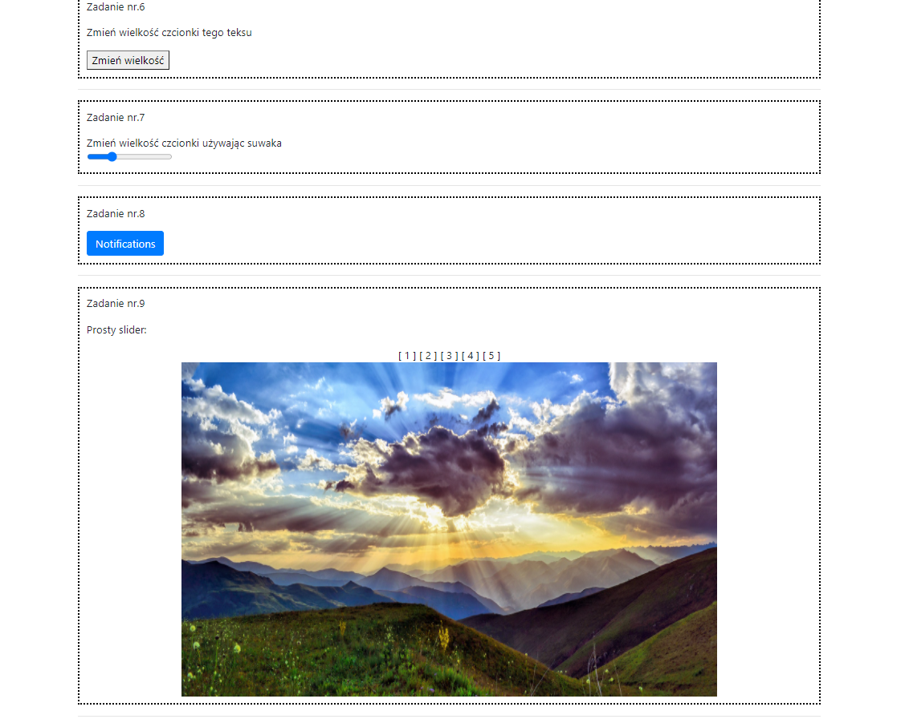
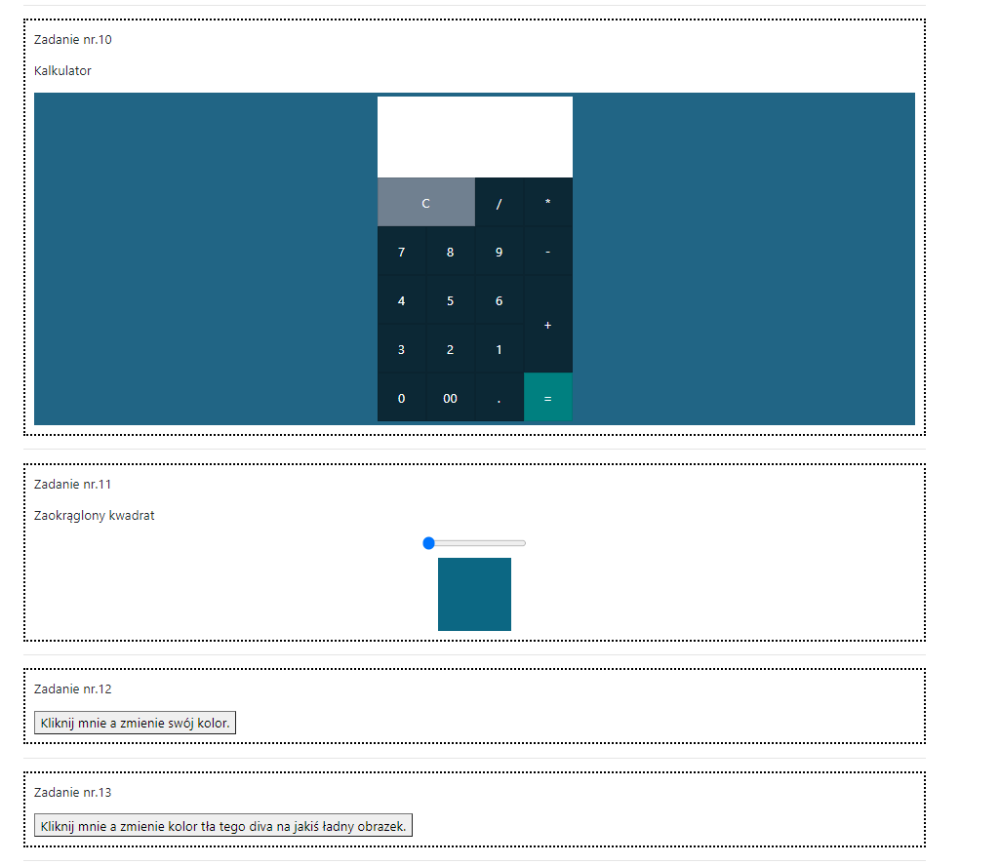
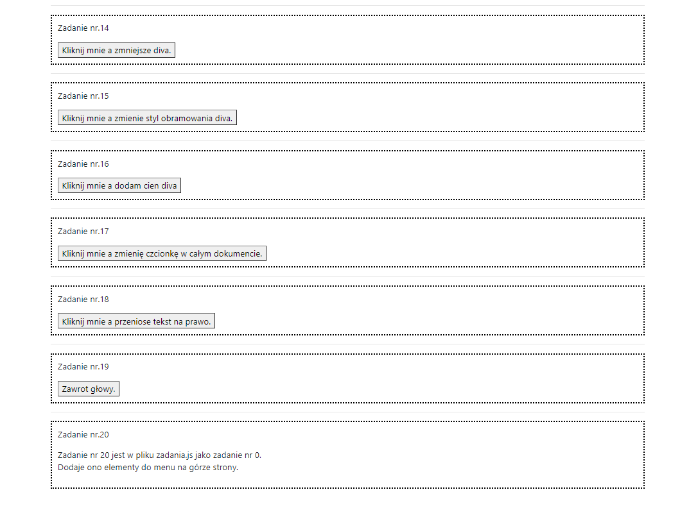
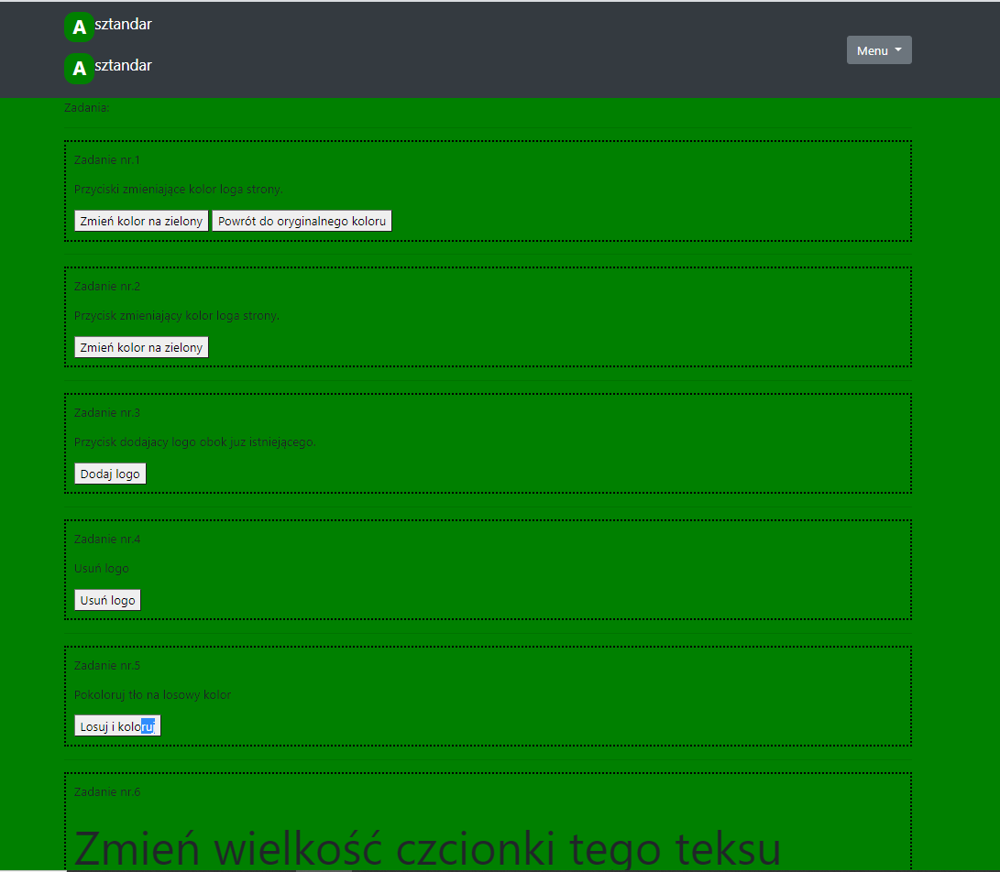
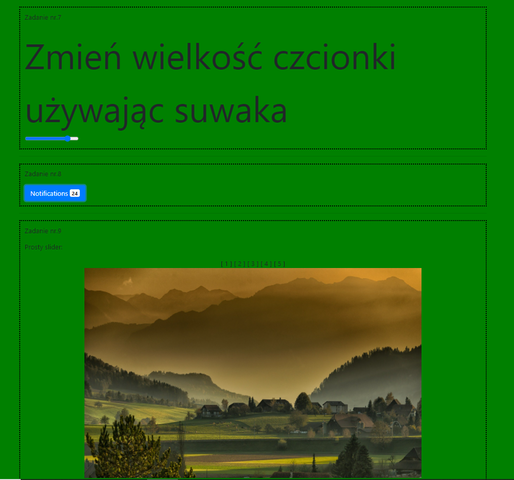
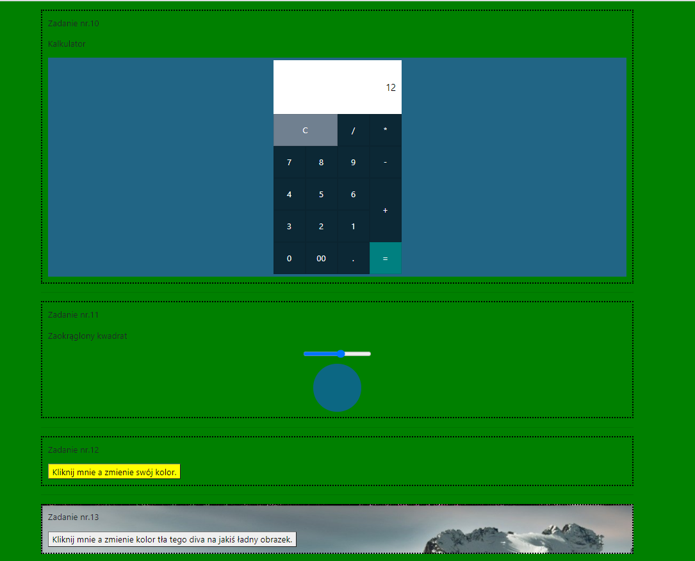
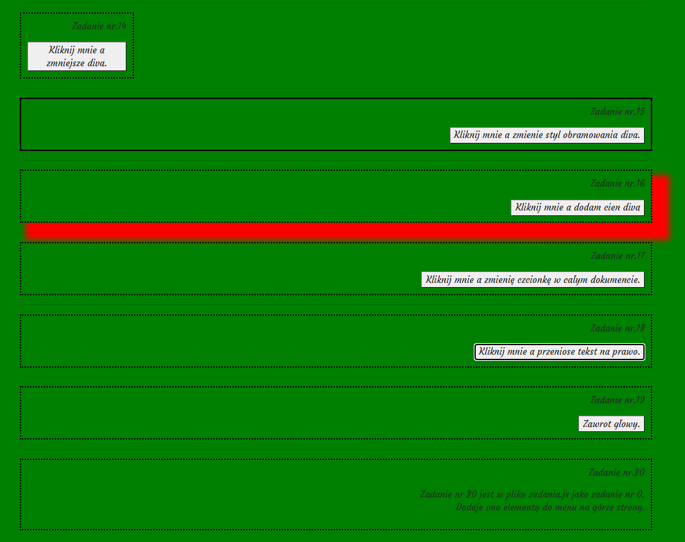

# Lab2 Praca z elementami DOM + ćwiczenia

### Wykorzystane technologie.
* HTML5
* Bootstrap
* CSS
* JavaScript

### Przedstawienie strony
__Strona główna__ - Na stronie umieszczone są zadania od 1-20 (przy czym zadanie 20 to u mnie zadanie 0).

__Zadania od 1 do 5__

__Zadania od 6 do 9__

__Zadania od 10 do 13__

__Zadania od 14 do 20__

## Prezentacja rezultatów

__Zadania od 1 do 6__

__Zadania od 7 do 9__

__Zadania od 10 do 13__

__Zadania od 14 do 20__

# "use strict" użyte w zadaniu 8