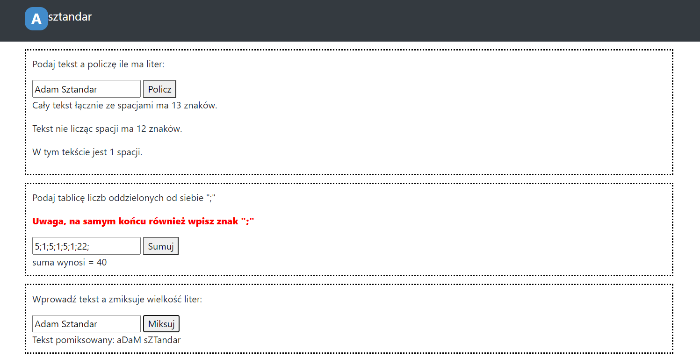
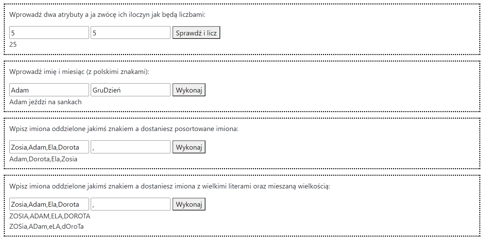
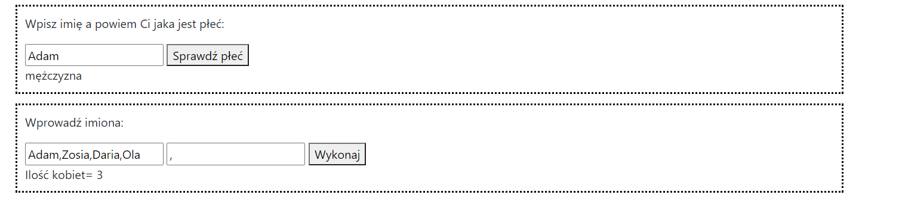
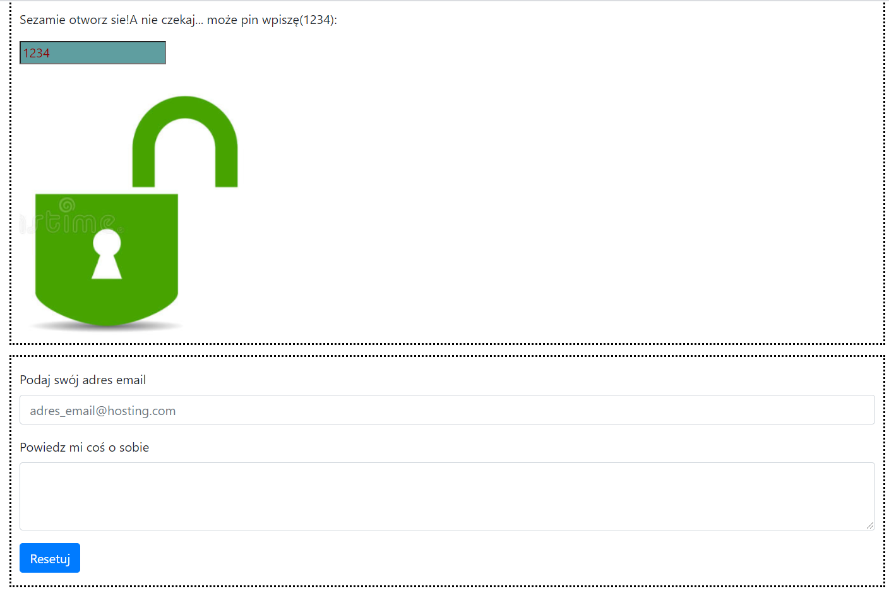
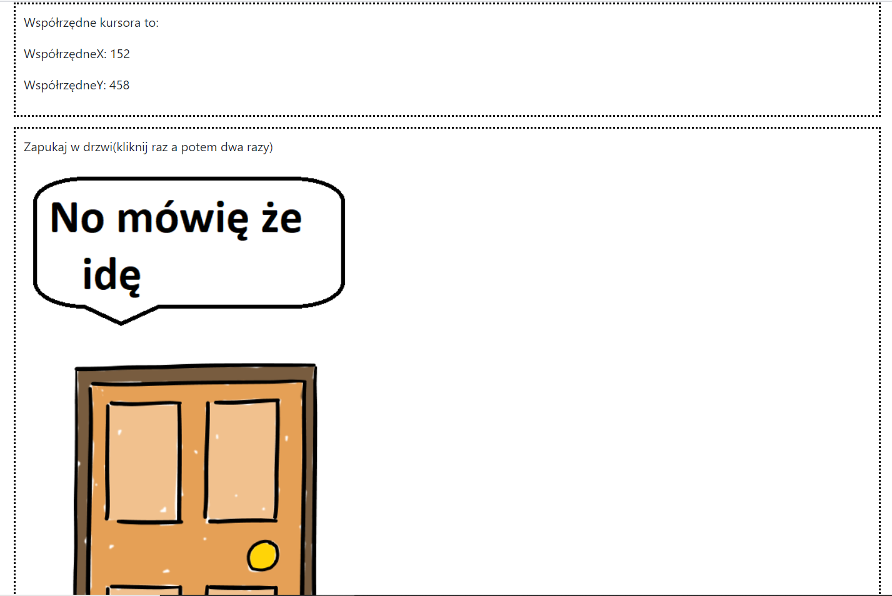
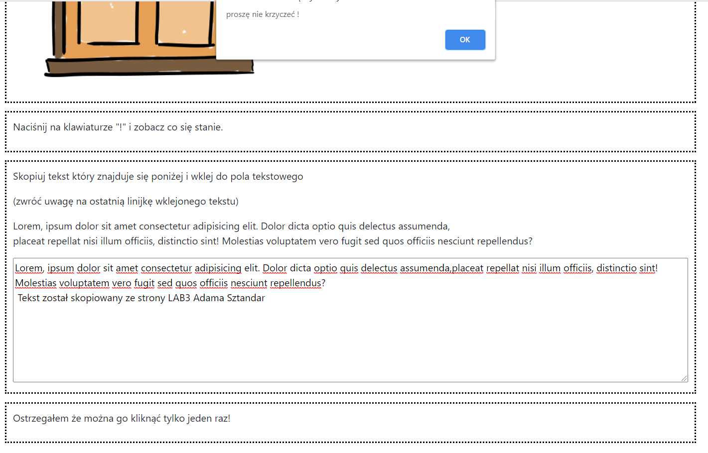

# Lab2 Praca z elementami DOM + ćwiczenia

### Wykorzystane technologie.
* HTML5
* Bootstrap
* CSS
* JavaScript

### Przedstawienie strony
__Strona główna__ - Na stronie umieszczone są zadania z tematyki Zdarzenia JavaScript.

