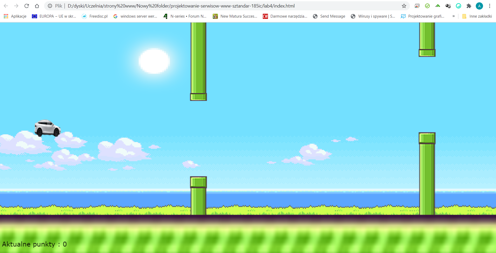
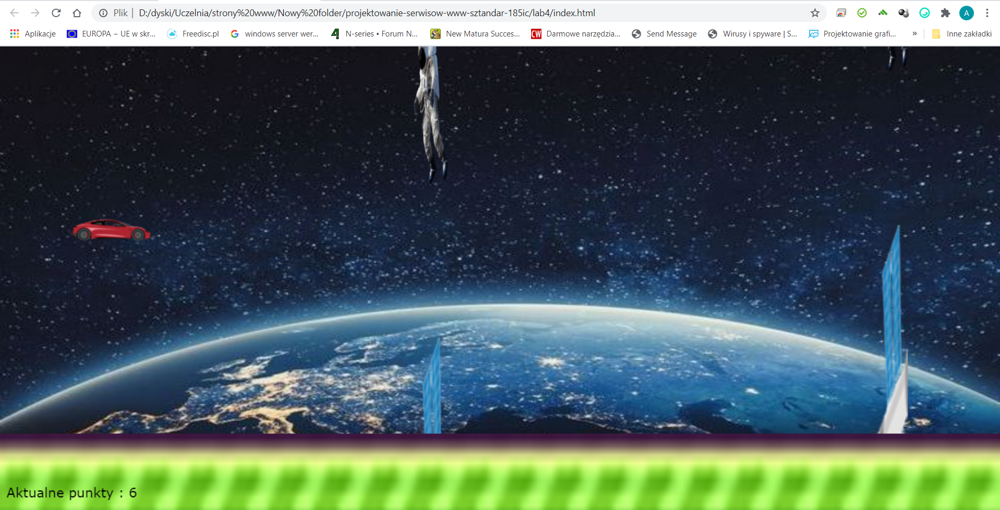
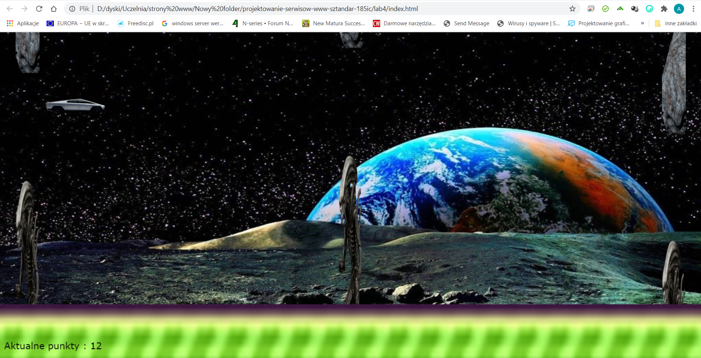

# Lab2 Praca z elementami DOM + ćwiczenia

### Wykorzystane technologie.
* HTML5
* CSS
* JavaScript

### Przedstawienie strony
__Strona główna__ - od razu po uruchomieniu strony uruchamia się gra.

## Sterowanie

### sterowanie odbywa się poprzez klikanie jakiegokolwiek przycisku na klawiaturze

__Po uzyskaniu 5 pkt__

__Po uzyskaniu 10 pkt__

