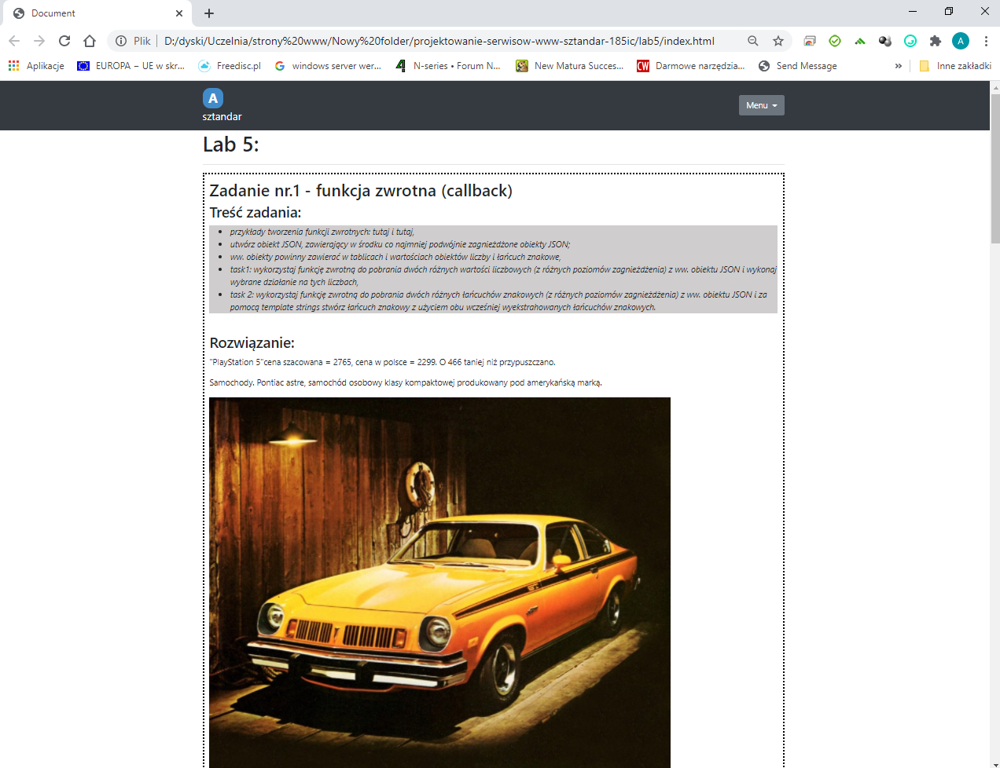
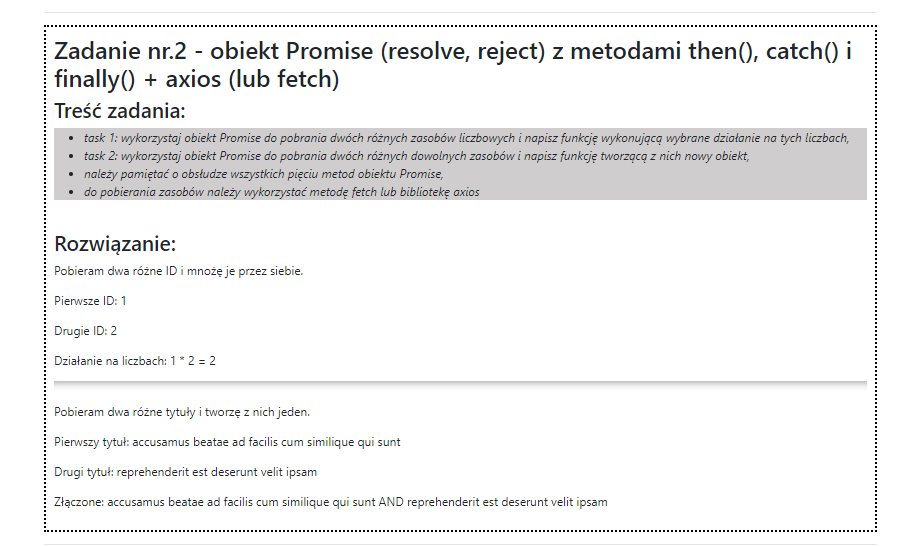
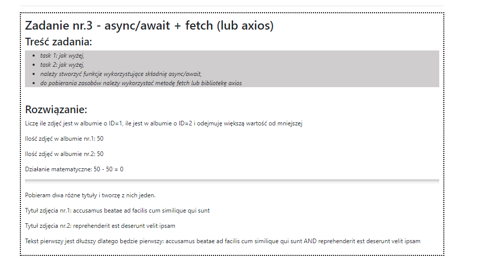
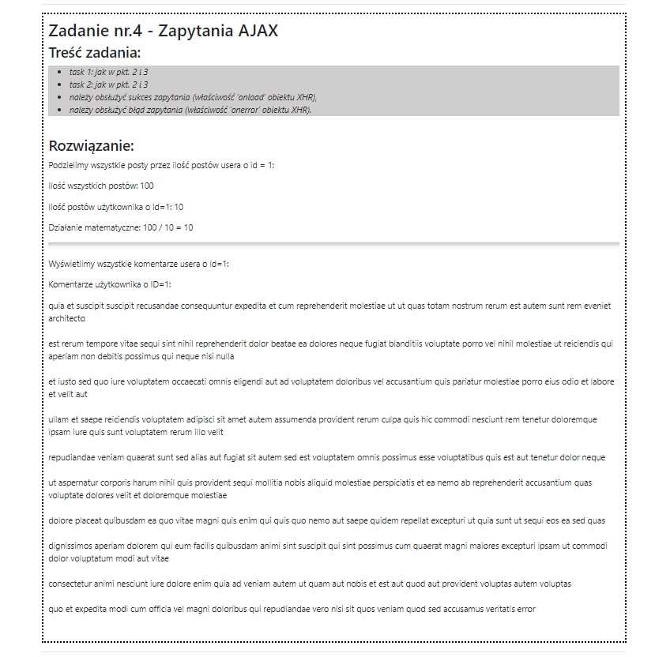
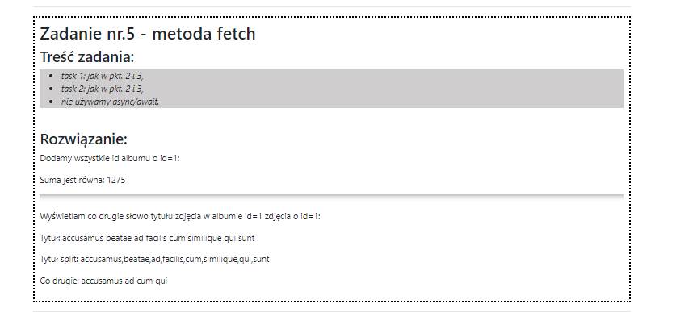
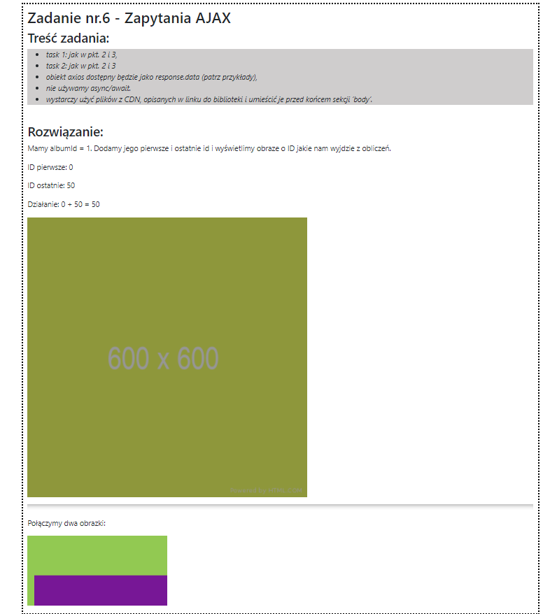

# Lab2 Praca z elementami DOM + ćwiczenia

### Wykorzystane technologie.
* HTML5
* CSS
* JavaScript

### Przedstawienie strony
__Strona główna__ - Na stronie głównej zawarte są poszczególne zadania - treść i rozwiązanie.

__Zadanie 1__

__Zadanie 2__

__Zadanie 3__

__Zadanie 4__

__Zadanie 5__

__Zadanie 6__

