# Lab6

### Wykorzystane technologie.
* React.js
* Bootstrap

### Przedstawienie strony
__Strona główna__ - Na stronie umieszczone są zadania z tematyki Zdarzenia JavaScript.
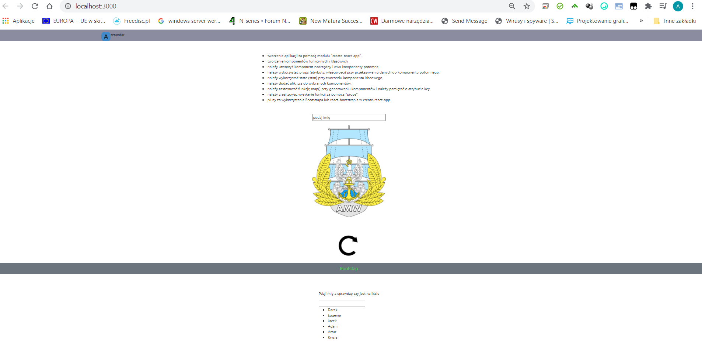

#### Tworzenie komponentów funkcyjnych i klasowych,
__Komponent funkcyjny:__
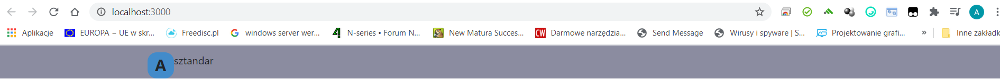
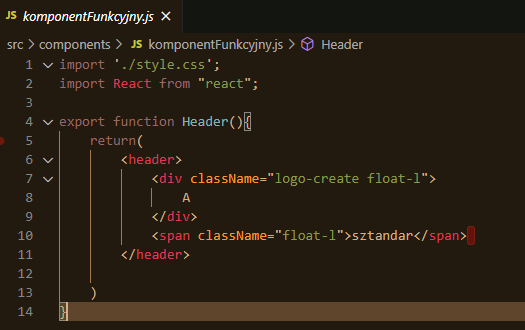

__Komponent klasowy:__
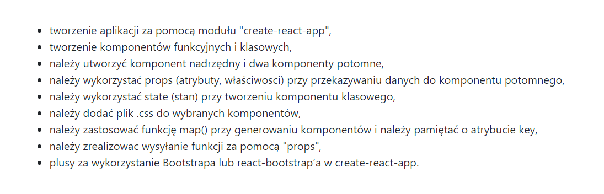
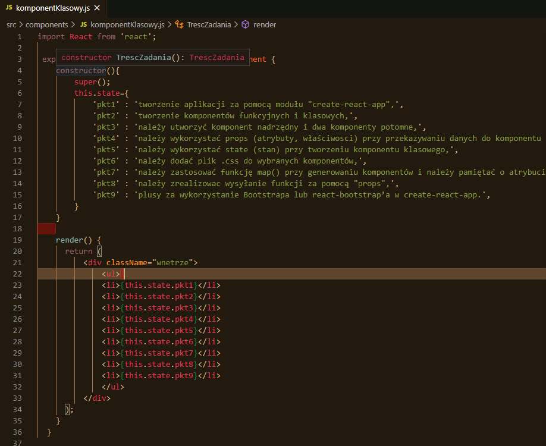

#### należy utworzyć komponent nadrzędny i dwa komponenty potomne, należy wykorzystać props (atrybuty, właściwosci) przy przekazywaniu danych do komponentu potomnego
__Komponent nadrzędny:__
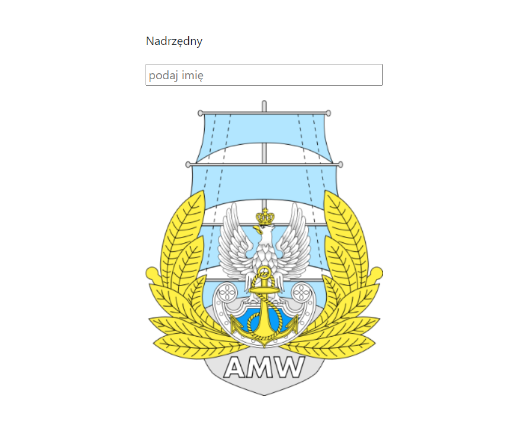
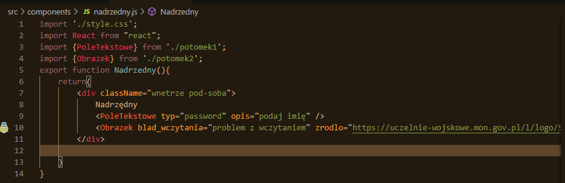

__Komponent potomny:__
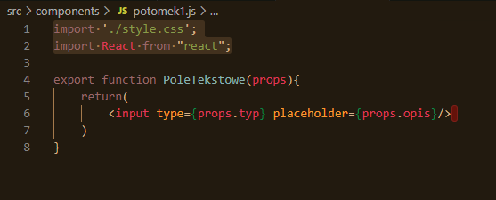
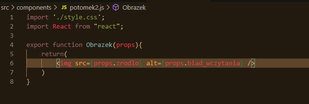

#### Zwróćmy również uwagę na wykorzystanie props.

#### należy wykorzystać state (stan) przy tworzeniu komponentu klasowego,
Zostało to wykonane przy tworzeniu komponentu klasowego (patrz cztery obrazki wyżej).

#### należy dodać plik .css do wybranych komponentów,
CSS użyty w komponencie funkcyjnym.

#### należy zastosować funkcję map() przy generowaniu komponentów i należy pamiętać o atrybucie key,
__Map i key:__
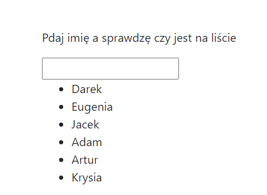
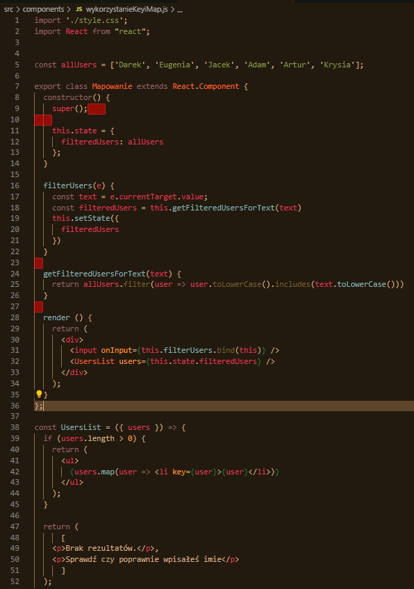

#### należy zrealizowac wysyłanie funkcji za pomocą "props"
__Obrót stroną:__
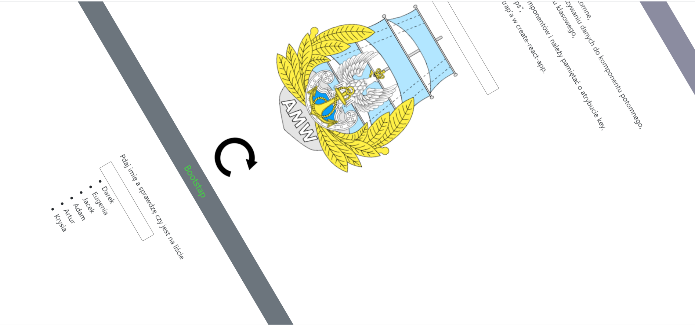
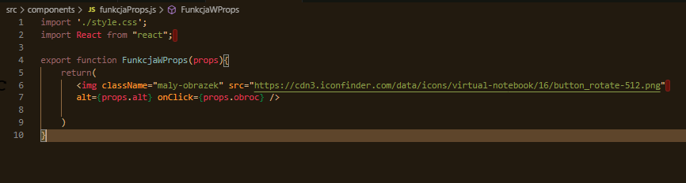
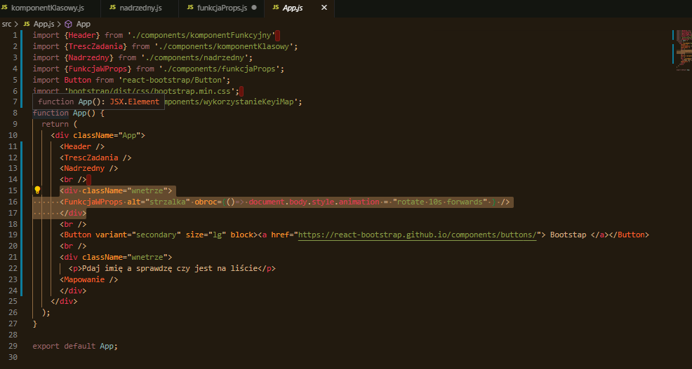

#### plusy za wykorzystanie Bootstrapa lub react-bootstrap’a w create-react-app.
__Przycisk: __

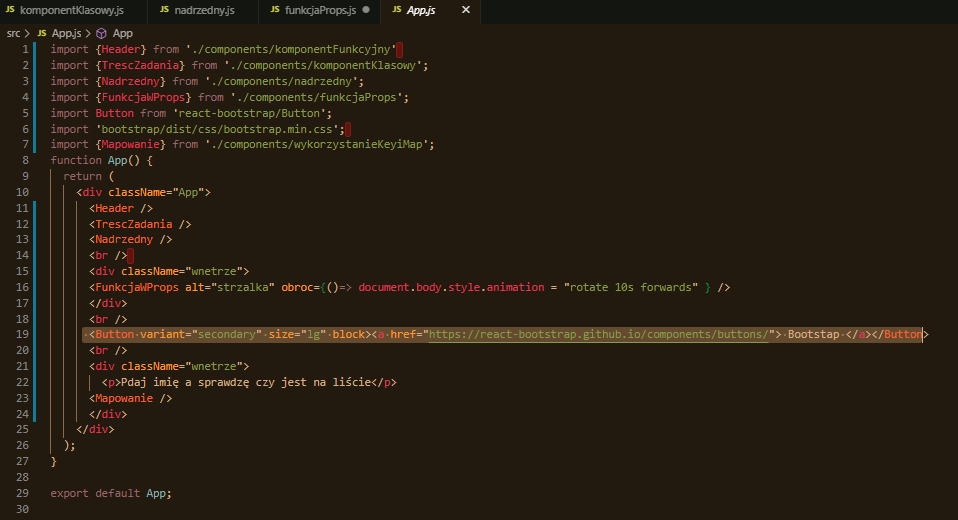

## Wszystkie podpunkty zadania zostały zrealizowane.