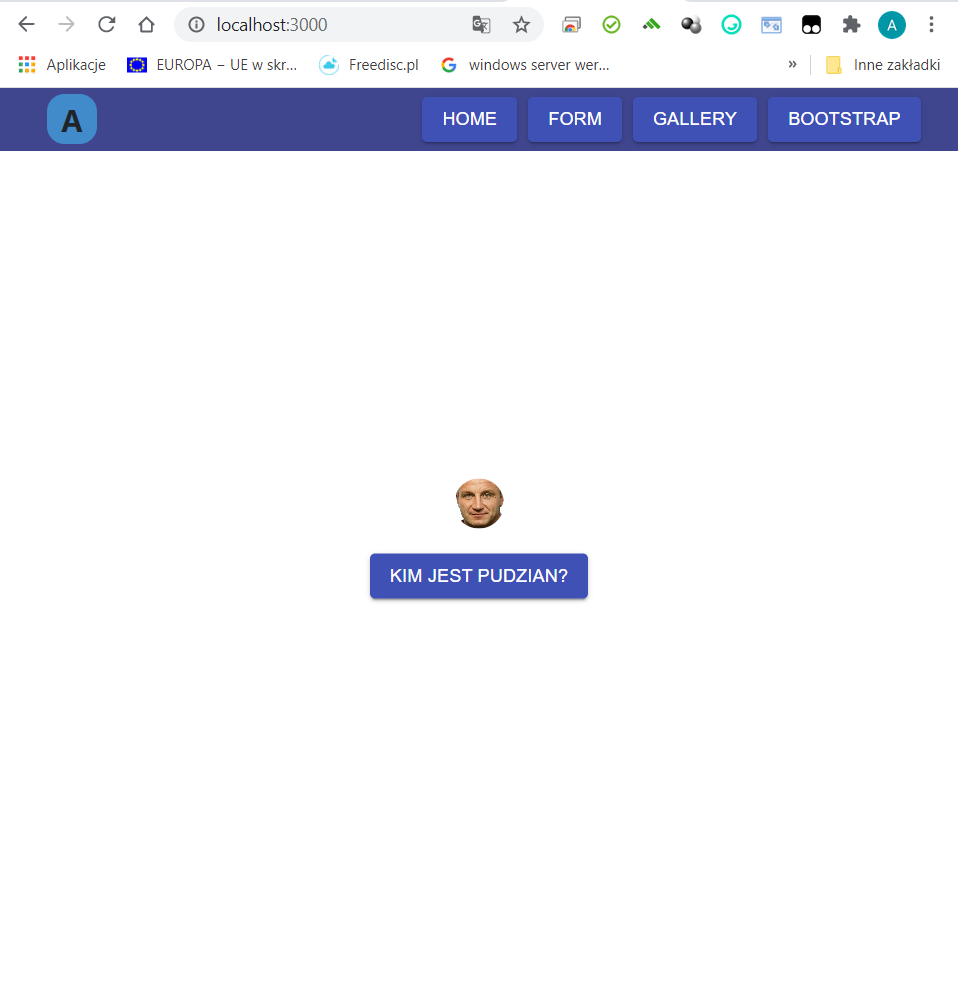
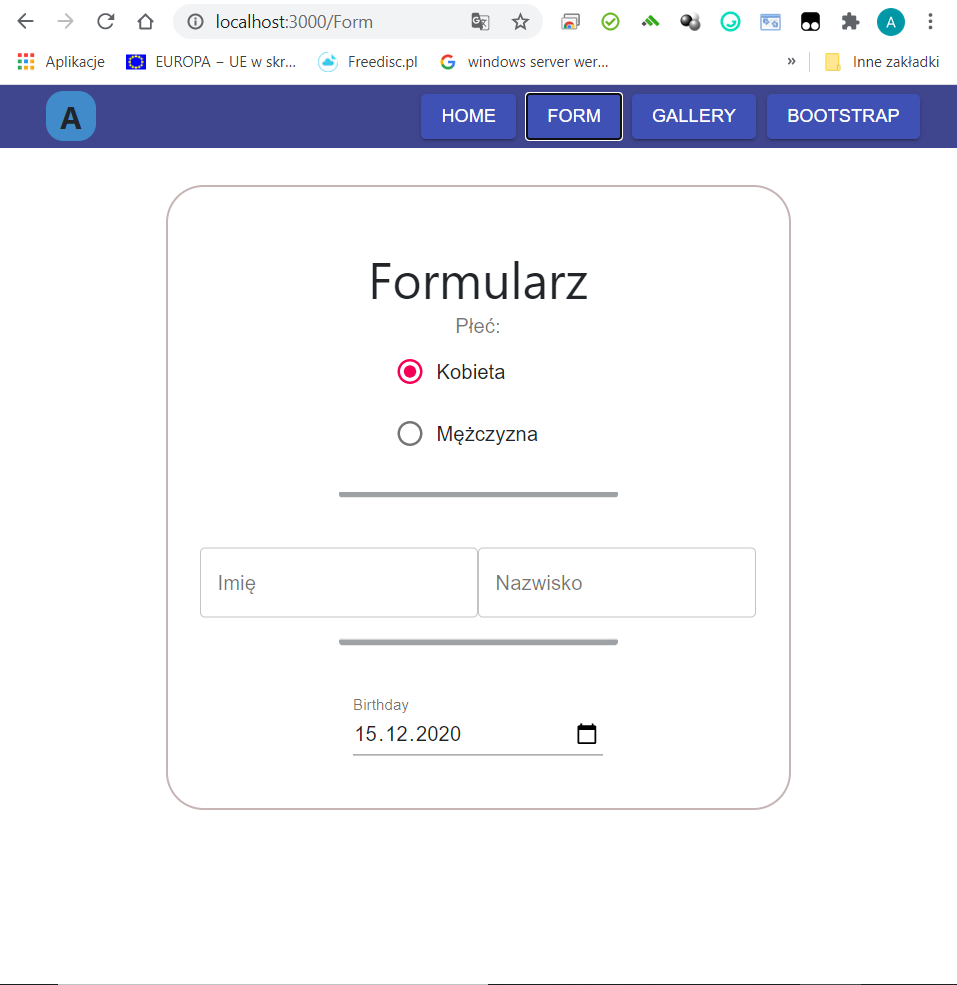
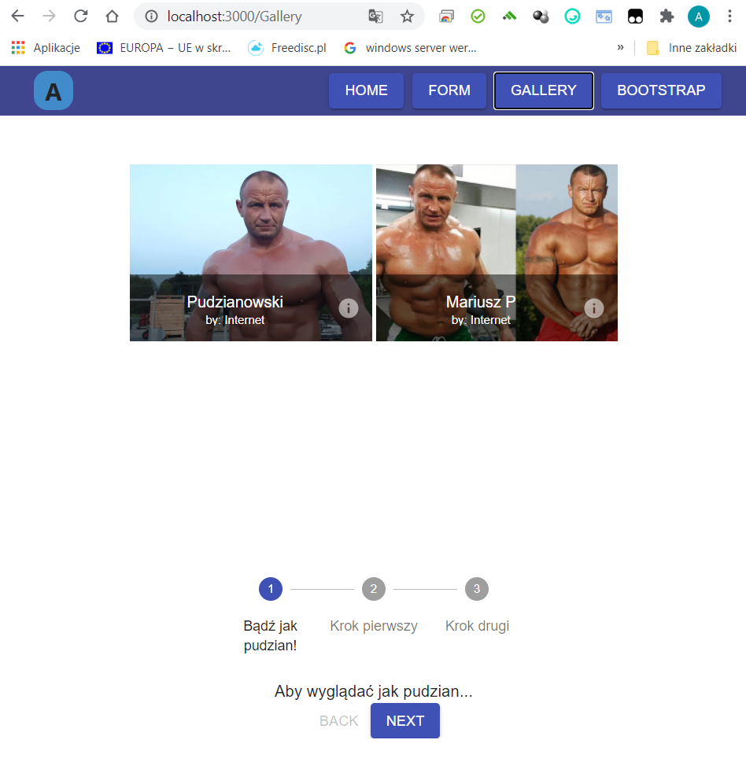
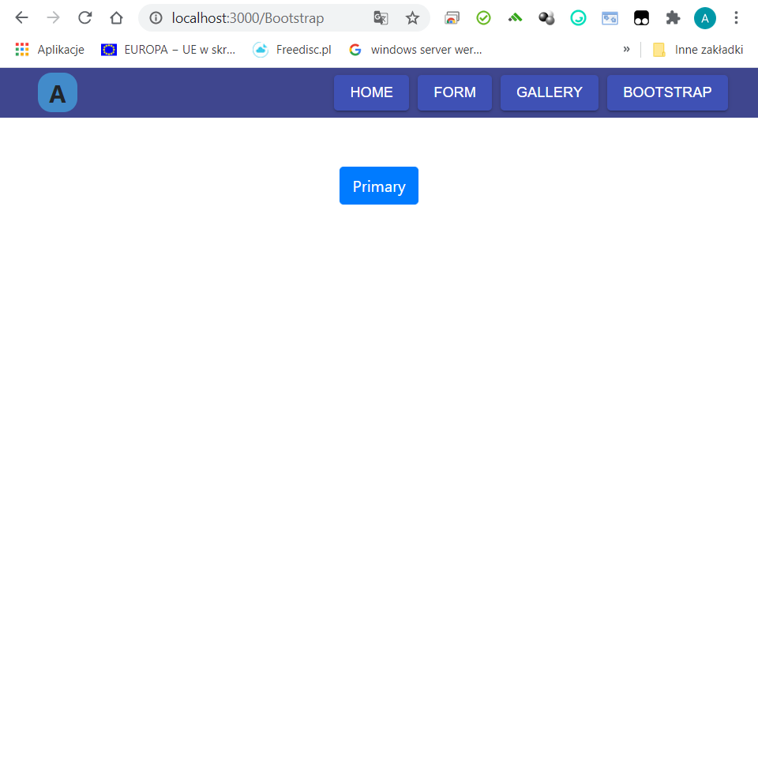

# Lab7

### Wykorzystane technologie.
* React.js
* Material-UI
* Bootstrap

### Strona główna
__Strona główna:__ 

-Avatar
-Popover
-Button

### Form
__Form:__

-Radio
-Form
-TextField

### Gallery
__Gallery:__

-Grid
-Icon
-Stepper

### Bootstrap
__Bootstrap:__

-Button

## Wszystkie podpunkty zadania zostały zrealizowane.