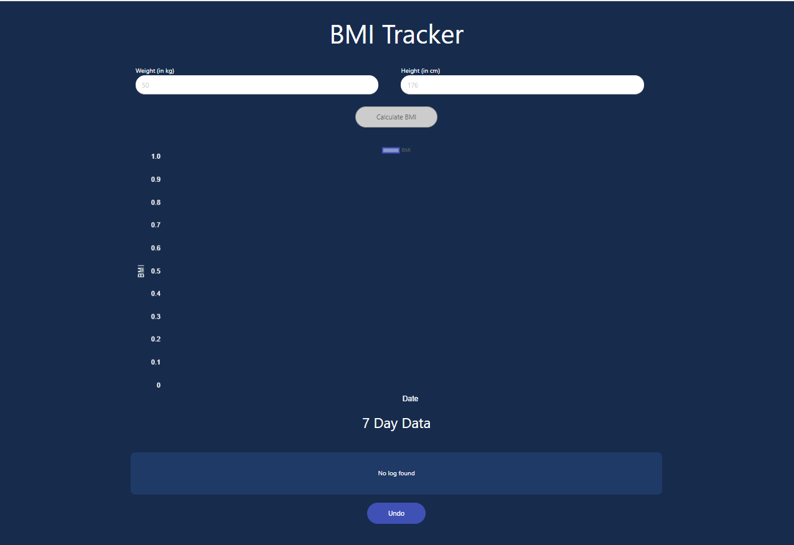
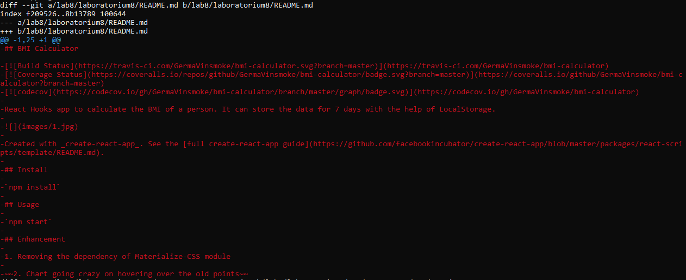
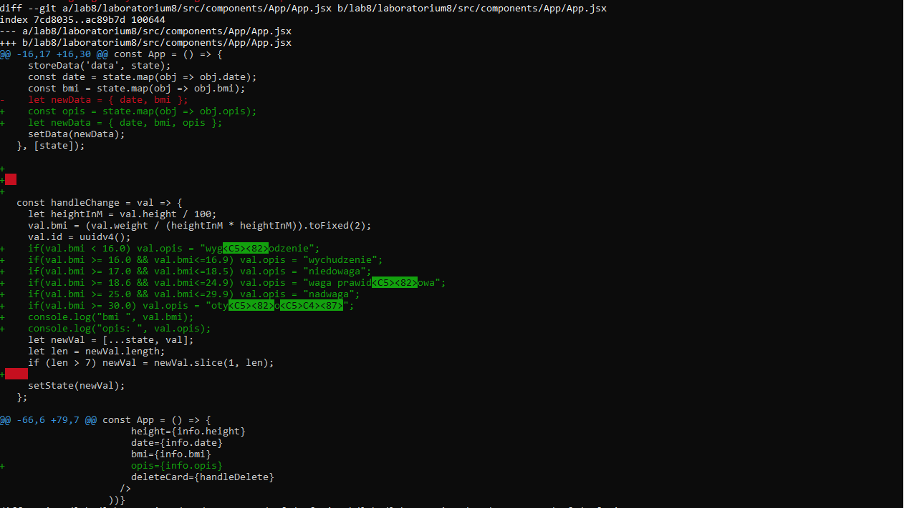
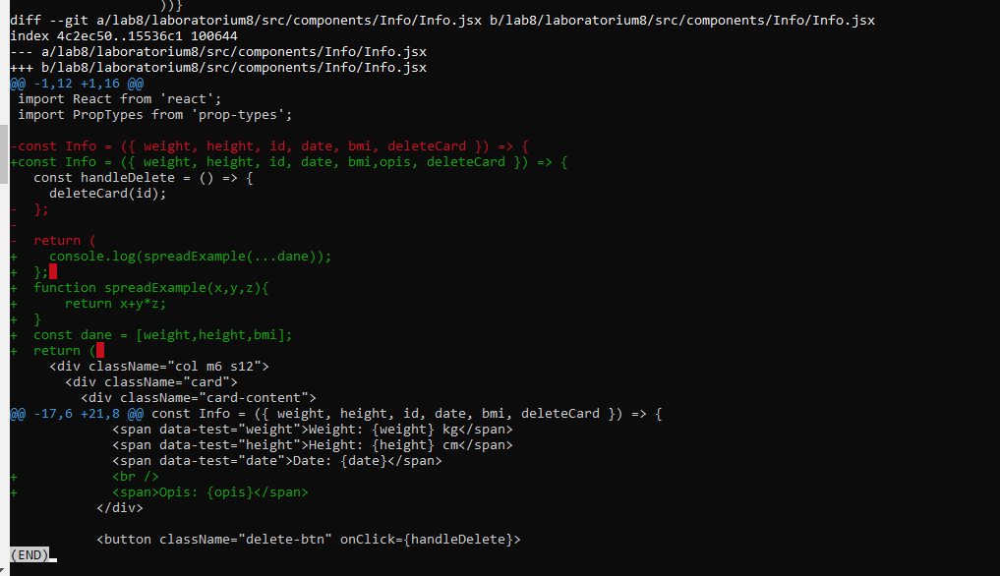
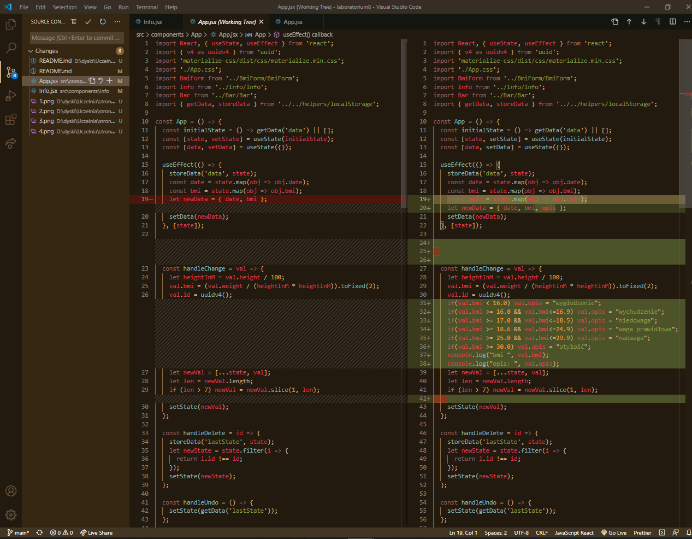
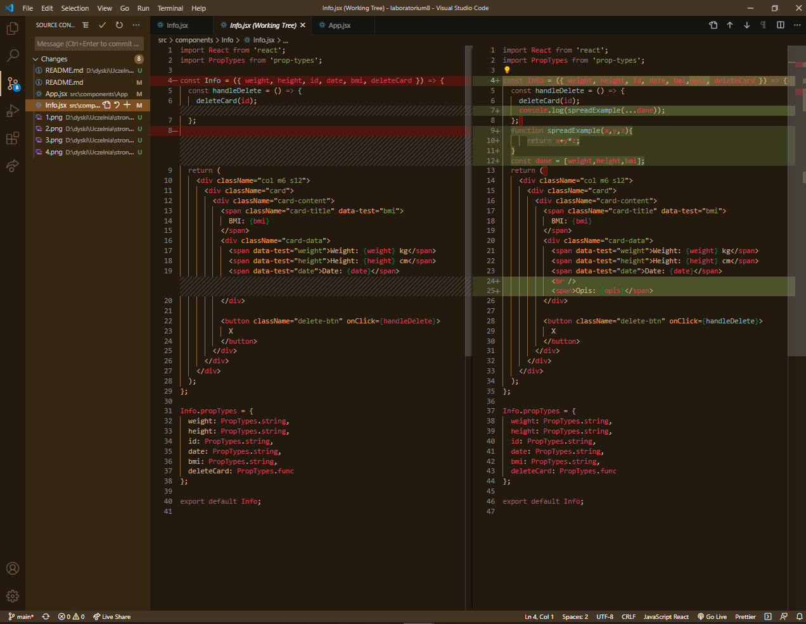
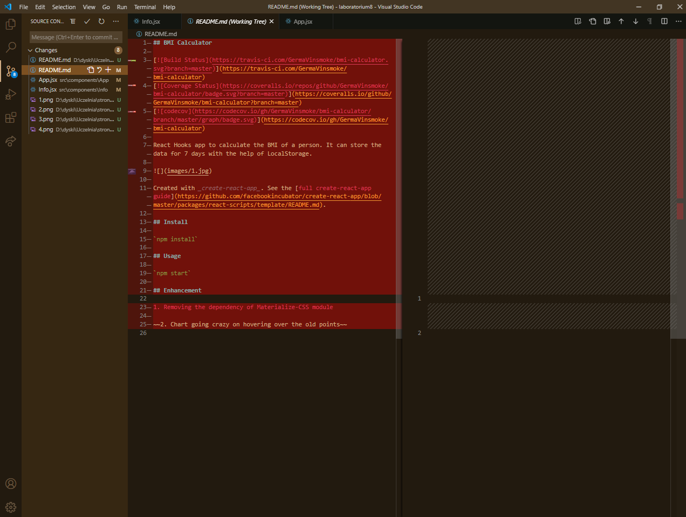
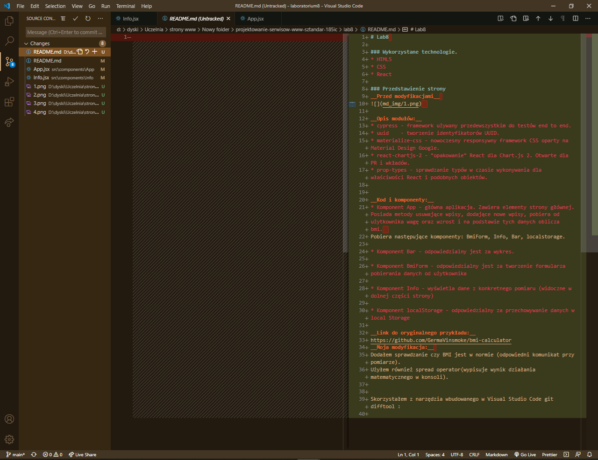
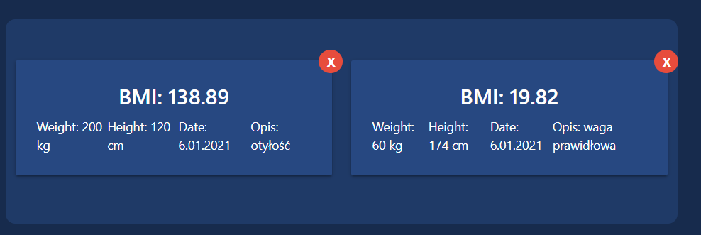
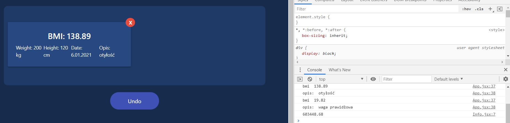

# Lab8 

### Wykorzystane technologie.
* HTML5
* CSS
* React

### Przedstawienie strony
__Przed modyfikacjami__ 
  

__Opis modułów:__
* cypress - framework używany przedewszystkim do testów end to end.
* uuid    - tworzenie identyfikatorów UUID.
* materialize-css - nowoczesny responsywny framework CSS oparty na Material Design Google.
* react-chartjs-2 - "opakowanie" React dla Chart.js 2. Otwarte dla PR i wkładów.
* prop-types - sprawdzanie typów w czasie wykonywania dla właściwości React i podobnych obiektów.

__Kod i komponenty:__
* Komponent App - główna aplikacja. Zawiera elementy strony głównej. Posiada metody usuwające wpisy, dodające nowe wpisy, pobiera od użytkownika wagę oraz wzrost i na podstawie tych danych oblicza bmi.  
Pobiera następujące komponenty: BmiForm, Info, Bar, localstorage.

* Komponent Bar - odpowiedzialny jest za wykres.

* Komponent BmiForm - odpowiedzialny jest za tworzenie formularza pobierania danych od użytkownika

* Komponent Info - wyświetla dane z konkretnego pomiaru (widoczne w dolnej części strony)

* Komponent localStorage - odpowiedzialny za przechowywanie danych w local Storage

__Link do oryginalnego przykładu:__
https://github.com/GermaVinsmoke/bmi-calculator
__Moja modyfikacja:__ 
Dodałem sprawdzanie czy BMI jest w normie (odpowiedni komunikat przy pomiarze).
Użyłem również spread operator(wypisuje wynik działania matematycznego w konsoli).

Skorzystałem z narzędzia wbudowanego w Visual Studio Code git difftool :

  
  
  
  
  
  
  

Moje modyfikacjie widoczne na zrzucie ekranu ( dodano opis):  
  
  